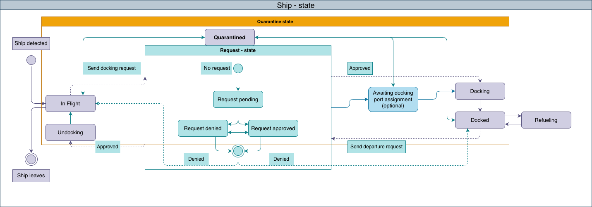
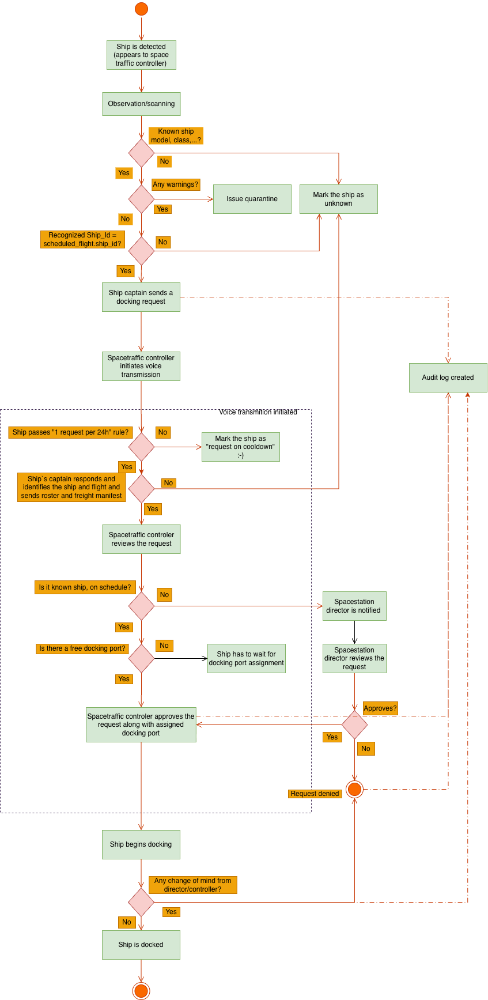

# SpaceDock-home-assignment
author: Jakub Stejskal

## Assignment 1 - Epic and user story overview
## 🛰️ EPIC 1 — Ship Traffic Monitoring

**Goal**  
Provide real-time overview of ships around and within the station.

**User Stories**
- View list of all currently docked ships
- View list of ships in station airspace (callsign, class)
- Distinguish scheduled vs. unscheduled / unknown ships
- Expand ship entry to view full ship detail
- Display scan warnings (explosives, alien infestation, reactor leakage) in list & detail
- Filter ships by status

**Actors**
- Space Traffic Controller
- Station Director (read-only)

---

## 🔗 EPIC 2 — Docking & Undocking Operations

**Goal**  
Enable operational handling of physical docking processes.

**User Stories**
- Assign a docking port to an arriving ship
- Change assigned docking port
- Undock a docked ship
- Initiate refueling for a docked ship

**Actors**
- Space Traffic Controller

---

## 📋 EPIC 3 — Landing & Takeoff Request Management

**Goal**  
Manage formal approval workflow for docking and departure.

**User Stories**
- Captain submits docking request
- Captain submits takeoff request
- Enforce one request per ship per day limit
- Controller approves/denies docking request
- Controller approves/denies takeoff request
- Director approves/denies unscheduled docking request
- Director approves/denies unscheduled takeoff request
- Change approval decision before docking/departure
- Maintain audit trail for all requests and decisions

**Actors**
- Ship Captain
- Space Traffic Controller
- Station Director
- Audit System

---

## 🔄 EPIC 4 — Ship Status & State Management

**Goal**  
Ensure consistent and valid lifecycle of ship states.

Ship status is governed by a controlled state model.

**User Stories**
- System automatically updates ship status based on workflow events
- Display ship status in list and detail
- Filter ships by status
- Transition ship to "Quarantined"
- Prevent invalid state transitions
- Maintain history of status changes

**Actors**
- System
- Space Traffic Controller

---

## 📡 EPIC 5 — Ship Communication Integration

**Goal**  
Enable secure communication between station and ships.

**User Stories**
- Initiate voice transmission to a selected ship
- Pass ship frequency and encryption codes to External Comms System
- Log communication initiation events

**Actors**
- Space Traffic Controller
- External Comms System

---

## 📅 EPIC 6 — Flight Schedule Management

**Goal**  
Manage planned arrivals and departures.

**User Stories**
- Create scheduled flight (flight number, ship, date, destination)
- Update scheduled flight
- Delete scheduled flight
- List all scheduled flights
- Edit flights in draft mode
- Publish draft flight schedule
- Assign ship to scheduled flight

**Actors**
- Station Director

---

## 💰 EPIC 7 — Docking Fees & Billing

**Goal**  
Manage financial aspects of docking operations.

**User Stories**
- Manage docking fee schedule / pricing
- Apply docking fee to a docked ship
- View docking fee summary

**Actors**
- Station Director

---

## 🛂 EPIC 8 — KYC & Passenger Verification

**Goal**  
Ensure regulatory compliance and passenger validation.

**User Stories**
- View persons on ship crew roster
- View person detail with flight history (dates, departure, destination, ship)
- View person’s citizenship status within Human Colony Federation
- Run KYC check on passengers entering the station

**Actors**
- Station Director

---

## 🖥️ EPIC 9 — Public Information Displays

**Goal**  
Provide arrival/departure information for station crew and visitors.

**User Stories**
- Display scheduled arrivals on lobby screens (airport-style)
- Display scheduled departures on lobby screens
- Display arrivals/departures at docking port screens
- Automatically refresh information

**Actors**
- Station Crew (passive consumer)

---

## 🔔 EPIC 10 — Notifications

**Goal**  
Inform stakeholders about critical workflow events.

**User Stories**
- Send push notification to Director when unscheduled request requires approval
- Notify Director about pending approval
- Mark notification as handled

**Actors**
- Station Director (tablet / communicator)

## Assignment 1B - Detailed user story

**Detailed User Story 2 — Review Checklist & Approve/Deny Docking (Controller)**

Epic: EPIC 3  
As a Space Traffic Controller
I want review a docking request with system-provided checklist (schedule, scan warnings, 24h rule, manifest/roster confirmation)
So that I can approve or deny docking safely and consistently

**Preconditions**
	•	Docking request exists in SUBMITTED (or PENDING_REVIEW) state.

**Main Flow**
	1.	Controller opens request detail.
	2.	System shows checklist:
	•	24-hour rule evaluation result
	•	schedule match (scheduled/unscheduled)
	•	scan warnings: explosives / alien infestation / reactor leakage (from monitoring).  
	•	manifest/roster confirmation status  
	3.	Controller decides Approve or Deny with reason.
	4.	System:
	•	stores decision + immutable audit event
	•	transitions request to APPROVED or DENIED
	•	triggers next steps:
	•	if APPROVED and SCHEDULED: request can proceed to docking operations
	•	if UNSCHEDULED: routes for Director final approval (see Story 3)

**Acceptance Criteria**
	•	AC1 — Decision logged
	•	When controller approves/denies
	•	Then request status updates and an audit event is written.
	•	AC2 — Warnings visibility
	•	Given scan warnings exist for ship
	•	When controller opens request
	•	Then warnings are shown clearly and influence checklist result.
	•	AC3 — No action after terminal
	•	Given request is already DENIED or COMPLETED
	•	When controller attempts another decision
	•	Then system blocks it (or forces “decision change” via Story 4).

## Assignment 2 - Non-functional requirements

- 24/7/365 uptime -> standby backup sollution in case of blackout/failure/downtime (narrow and controlled downtimes)
- scaling (number of ships monitored, number of paralel dockings if not 1 at a time) - TODO - need to ask the customer
- resposivness - detection, scan result, ship status need to be readable ASAP (e.g. under 1 second), approvals should propagate within few seconds, communications should be streamed
- strict role based access to most interfaces and actions
- immutability of audit log (requests and decissions) 

## Assignment 3 - State diagram
Assumtions:
The actual ship status is directed by request status(es) and warning detection

## Assignment 4 - Entity relationship model
Assumptions:
- flight history track the records of a person across stations vs flights track flights for the one spacestation
  

## Assignment 5 - BPMN landing request workflow

Assumptions:
- Scan only detects potential warnings
- Freight manifest and roster need to be passed and confirmed by the captain
- System displays automatically known/unknown status (so it has to be able to asess it - detect it), warnings, 24 hour rule assesment
- Spacetrafic controller reviews checklist and approves if the checklist is passed
- if Director is involved, he sees controllers view but calls the final decission
- there possible variants to the communication procedure and further answers are needed  -- TODO ask customer to walk through the how the communication is expeted to happen (for example wheather voice transmission is used in all cases? Or if the communication can be resolved via automated checklist sequence just with "click confirm" approval by controllers if everything checkes

## Assignment 6 - Questions for the customer
- What are the scale characteristics reguarding: number of ships monitored, number of paralel docking ships, number of docking ports, number of existing spacetraffic controllers)
- Where does space traffic controller get the ships frequency and encryption codes without the ship explicitly passing them? (How can he initiate voice communication)
- Is voice communication required or can regular flights can be dispatched without direct connection (e.g. scan with zero warnings + full automatic identification + scheduled flight pairing = docking approved)
- Reguarding request once per day - Is it 24h from the last request or within "a day" on the spacestation? What is the reference.
- How does the scan work. Do we rely oe "one general scan" or is agregate of many observation (say visual + xray)? What things does it scan at what distance. Does it scan the ship`s crew, cargo, as well? 
